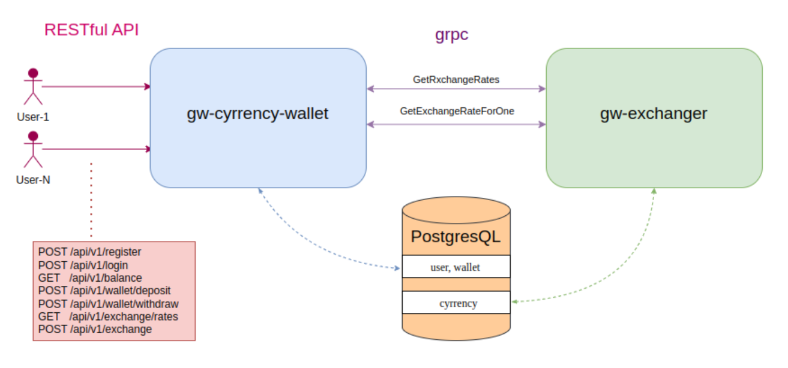

### Задача
Разработать два сервиса:
- кошелек-обменник с авторизацией (**gw-currency-wallet**)
- сервис exchanger для получения курсов валют (**gw-exchanger**)

<div align="center">
  <picture>
    
  </picture>
</div>

Сервисы должны общаться между собой по grpc

### 1. Создайте протофайл

Пример ```exchange.proto```:

```protobuf
syntax = "proto3";

package exchange;

option go_package = "github.com/proto-exchange/exchange_grpc";

// Определение сервиса
service ExchangeService {
    // Получение курсов обмена всех валют
    rpc GetExchangeRates(Empty) returns (ExchangeRatesResponse);
    
    // Получение курса обмена для конкретной валюты
    rpc GetExchangeRateForCurrency(CurrencyRequest) returns (ExchangeRateResponse);
}

// Запрос для получения курса обмена для конкретной валюты
message CurrencyRequest {
    string from_currency = 1;
    string to_currency = 2;
}

// Ответ с курсом обмена для конкретной валюты
message ExchangeRateResponse {
    string from_currency = 1;
    string to_currency = 2;
    float rate = 3;
}

// Ответ с курсами обмена всех валют
message ExchangeRatesResponse {
    map<string, float> rates = 1; // ключ: валюта, значение: курс
}

// Пустое сообщение
message Empty {}
```

#### Структура директории
```
proto-exchange/
├── exchange/
│     └── exchange.proto
└── go.mod
```

#### Генерация кода
```shell
go get google.golang.org/protobuf/cmd/protoc-gen-go
go get google.golang.org/grpc/cmd/protoc-gen-go-grpc
cd ./exchange
protoc --go_out=. --go_opt=paths=source_relative --go-grpc_out=. --go-grpc_opt=paths=source_relative --experimental_allow_proto3_optional exchange.proto
```

---

### 2. Создание сервиса exchanger для получения курсов валют (gw-exchanger)
В качестве базы использовать PostgresQL (но описать интерфейс, чтобы можно было поменять на любую БД).
Сами значения курса валют сервис должен получать из БД.
Сервис по grpc должен обрабатывать запросы на получение курса валют.
В качестве валют поддерживаются **USD, RUB, EUR**.

Структура проекта
```
gw-exchanger/
├── cmd/
│     └── main.go
├── pkg/
│     ├── utils.go
│     └── ...
│         └── ...
├── internal/
│     ├── storages/
│     │   ├── storage.go (интерфейс)
│     │   ├── model.go
│     │   └── postgres/
│     │        ├── connector.go
│     │        └── methods.go
│     ├── config/
│     │    ├── config.go
│     │    └── defaults.go
│     └── .../
│         └── ...
├── go.mod
├── Dockerfile
├── config.env
├── Makefile
└── README.md
```

Сервис должен иметь продвинутое логирование + читать пересеммные окружения из config.env (для локального запуска)
```shell
GOOS=linux GOARCH=amd64 go build -o main ./cmd
./main -c config.env
```

---

### 3. Разработка микросервиса для управления кошельком и обмена валют (gw-currency-wallet)
Микросервис должен поддерживать регистрацию и авторизацию пользователей, пополнение счета, вывод средств,
получение курсов валют и обмен валют. В качестве базы данных используется PostgreSQL.
Для взаимодействия с внешним сервисом курсов валют используется gRPC.

Стек технологий: _Gin (или другой HTTP-фреймворк), JWT для авторизации, gRPC для получения курсов валют и обмена_

API должен быть RESTful.

▎1. Регистрация пользователя

Метод: **POST**  
URL: **/api/v1/register**  
Тело запроса:
```json
{
  "username": "string",
  "password": "string",
  "email": "string"
}
```

Ответ:
• Успех: ```201 Created```
```json
{ 
  "message": "User registered successfully"
}
```

• Ошибка: ```400 Bad Request```
```json
{
  "error": "Username or email already exists"
}
```

▎Описание

Регистрация нового пользователя. 
Проверяется уникальность имени пользователя и адреса электронной почты.
Пароль должен быть зашифрован перед сохранением в базе данных.


---
▎2. Авторизация пользователя

Метод: **POST**  
URL: **/api/v1/login**  
Тело запроса:
```json
{
"username": "string",
"password": "string"
}
```

Ответ:

• Успех: ```200 OK```
```json
{
  "token": "JWT_TOKEN"
}
```

• Ошибка: ```401 Unauthorized```
```json
{
  "error": "Invalid username or password"
}
```

▎Описание

Авторизация пользователя.
При успешной авторизации возвращается JWT-токен, который будет использоваться для аутентификации последующих запросов.

---

▎ 3. Получение баланса пользователя

Метод: **GET**  
URL: **/api/v1/balance**  
Заголовки:  
_Authorization: Bearer JWT_TOKEN_

Ответ:

• Успех: ```200 OK```

```json
{
  "balance":
  {
  "USD": "float",
  "RUB": "float",
  "EUR": "float"
  }
}
```

---

▎4. Пополнение счета

Метод: **POST**  
URL: **/api/v1/wallet/deposit**  
Заголовки:  
_Authorization: Bearer JWT_TOKEN_

Тело запроса:
```
{
  "amount": 100.00,
  "currency": "USD" // (USD, RUB, EUR)
}
```

Ответ:

• Успех: ```200 OK```
```json
{
  "message": "Account topped up successfully",
  "new_balance": {
    "USD": "float",
    "RUB": "float",
    "EUR": "float"
  }
}
```

• Ошибка: ```400 Bad Request```
```json
{
"error": "Invalid amount or currency"
}
```

▎Описание

Позволяет пользователю пополнить свой счет. Проверяется корректность суммы и валюты.
Обновляется баланс пользователя в базе данных.

---

▎5. Вывод средств

Метод: **POST**  
URL: **/api/v1/wallet/withdraw**  
Заголовки:  
_Authorization: Bearer JWT_TOKEN_

Тело запроса:
```
{
    "amount": 50.00,
    "currency": "USD" // USD, RUB, EUR)
}
```

Ответ:

• Успех: ```200 OK```
```json
{
  "message": "Withdrawal successful",
  "new_balance": {
    "USD": "float",
    "RUB": "float",
    "EUR": "float"
  }
}
```

• Ошибка: 400 Bad Request
```json
{
  "error": "Insufficient funds or invalid amount"
}
```

▎Описание

Позволяет пользователю вывести средства со своего счета.
Проверяется наличие достаточного количества средств и корректность суммы.

---

▎6. Получение курса валют

Метод: **GET**  
URL: **/api/v1/exchange/rates**  
Заголовки:  
_Authorization: Bearer JWT_TOKEN_

Ответ:

• Успех: ```200 OK```
```json
{
    "rates": 
    {
      "USD": "float",
      "RUB": "float",
      "EUR": "float"
    }
}
```

• Ошибка: ```500 Internal Server Error```
```json
{
  "error": "Failed to retrieve exchange rates"
}
```

▎Описание

Получение актуальных курсов валют из внешнего gRPC-сервиса.
Возвращает курсы всех поддерживаемых валют.

---

▎7. Обмен валют

Метод: **POST**  
URL: **/api/v1/exchange**  
Заголовки:  
_Authorization: Bearer JWT_TOKEN_

Тело запроса:
```json
{
  "from_currency": "USD",
  "to_currency": "EUR",
  "amount": 100.00
}
```

Ответ:

• Успех: ```200 OK```
```json
{
  "message": "Exchange successful",
  "exchanged_amount": 85.00,
  "new_balance":
  {
  "USD": 0.00,
  "EUR": 85.00
  }
}
```

• Ошибка: 400 Bad Request
```json
{
  "error": "Insufficient funds or invalid currencies"
}
```

▎Описание

Курс валют осуществляется по данным сервиса exchange (если в течении небольшого времени был запрос от клиента курса валют (**/api/v1/exchange**) до обмена, то
брать курс из кэша, если же запроса курса валют не было или он запрашивался слишком давно, то нужно осуществить gRPC-вызов к внешнему сервису, который предоставляет актуальные курсы валют)
Проверяется наличие средств для обмена, и обновляется баланс пользователя.

#### Структура проекта

```
gw-currency-wallet/
├── cmd/
│     └── main.go
├── pkg/
│     ├── utils.go
│     └── ...
│         └── ...
├── internal/
│     ├── storages/
│     │   ├── storage.go (интерфейс)
│     │   ├── model.go
│     │   └── postgres/
│     │        ├── connector.go
│     │        └── methods.go
│     ├── config/
│     │    ├── config.go
│     │    └── defaults.go
│     └── .../
│         └── ...
├── docs/
│     ├── docs.go
│     ├── swagger.json
│     └── swagger.yaml
├── tests/
│     └── service_test.go
├── go.mod
├── Dockerfile
├── config.env
├── Makefile
└── README.md
```

Также нужно учесть:
1. Безопасность: Все запросы должны быть защищены JWT-токенами.
2. Производительность: Время отклика сервиса не должно превышать 200 мс для большинства операций.
3. Логирование: Все операции должны логироваться для дальнейшего анализа и отладки.
4. Тестирование: Необходимо написать юнит-тесты для всех основных функций.
5. Документация: Создать документацию API с использованием Swagger или аналогичного инструмента.

Сервис должен иметь продвинутое логирование + читать пересеммные окружения из config.env (для локального запуска)
```shell
GOOS=linux GOARCH=amd64 go build -o main ./cmd
./main -c config.env
```

---

### Притмечание

Для проверки работоспособности достаточно запустить локально базу данных (и написать миграции) и два сервиса, и в **postman** или c помощью **curl** проверить как работает API.
Также желатьльно написать README для каждого сервиса
